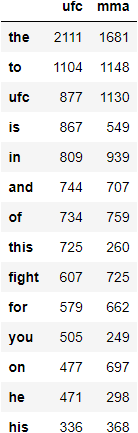
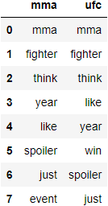
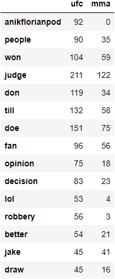
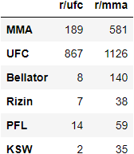
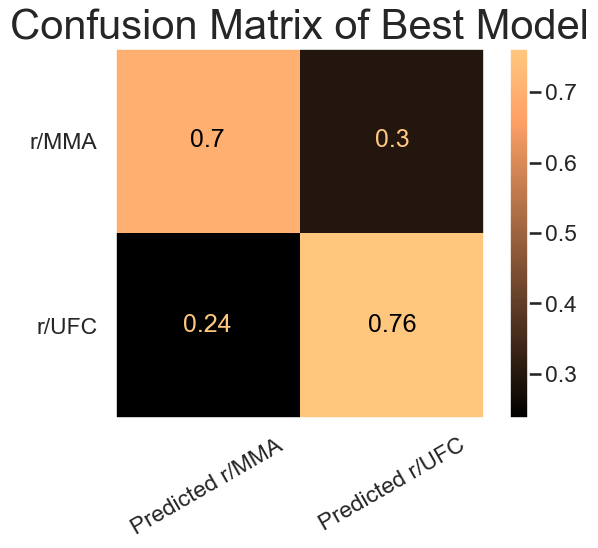
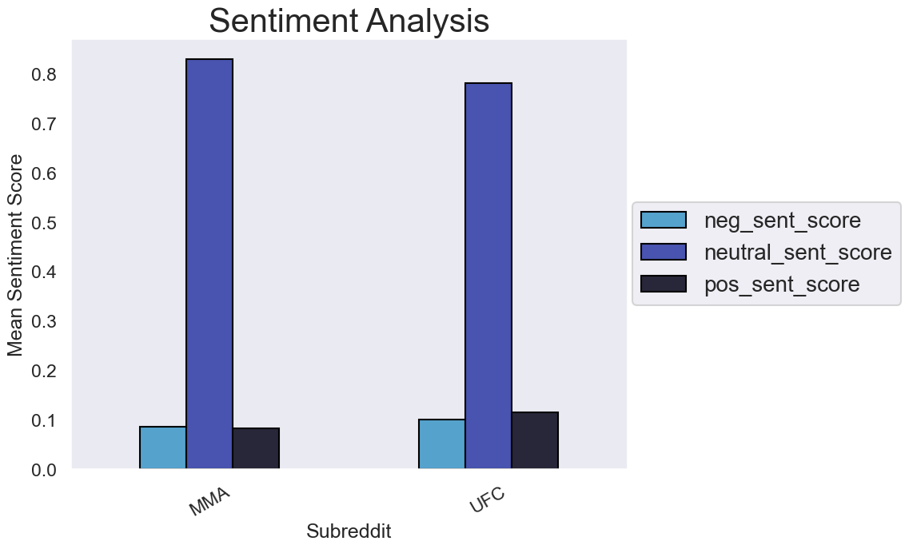
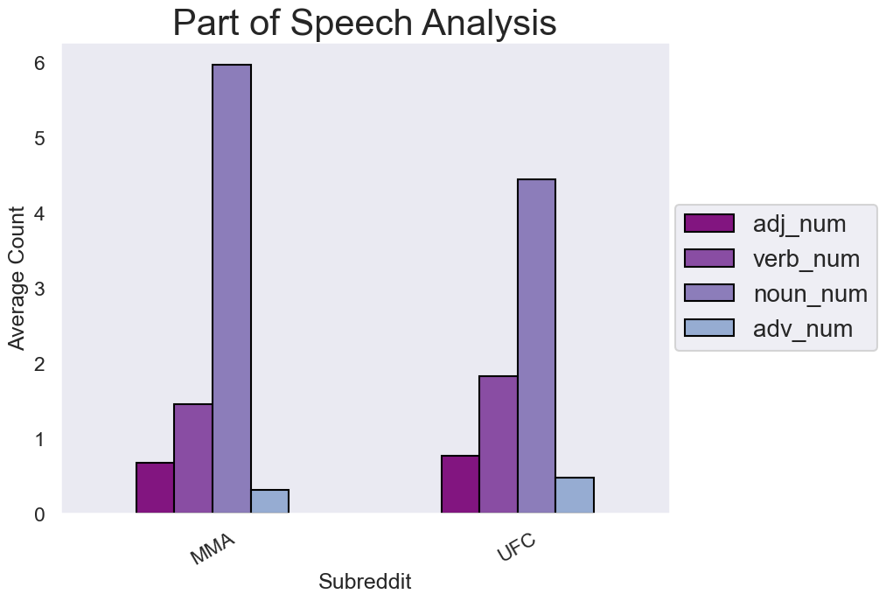

# Subreddit Classification Through Natural Language Processing and Ensemble Modeling

##### by Jeff Alexander  

---

## The Problem - Does the UFC have a Chokehold on MMA fandom?

#### Using data from the subreddits r/MMA and r/UFC through PushShift API collection, can a model correctly classify which subreddit a post belongs to?  
 
#### For:
Up-and-coming FURY MMA League whose goal is to one day compete with the UFC.  

---

#### Objective:  
Determine if a model can accurately predict (within 80% Accuracy) the correct subreddit a post belongs to. Moreover, this project aims to discover if the UFC has a monopoly on MMA fandom (determined by the inverse of the model's overall accuracy), as well as the keywords/features that currently exist within MMA that is unique from UFC. This is in order to ascertain fandoms/niches within MMA that the UFC currently lacks, while concurrently providing Marketing with potential strategies moving forward.

- The Title facet of a post will be used.
- Other metadata from posts might be used depending on it's ability to help the model's accuracy, as well as it's persistence across posts (i.e. - Comments will be exempt because vast majority of posts do not have comments associated with them)
- Stop words will be adjusted to include as many UFC fighters as possible, as well as the words 'ufc', 'ultimate', and 'Dana White'. This is to ensure the model isn't given C

#####

---
## The Data
#### Data Scraped Using Pushshift API for:
- UFC Subreddit
- MMA Subreddit
#####

---

## Methods Used:
- Pandas
- Matplotlib
- Seaborn
- Sklearn
- Inferential Statistics
- Data Visualization
- NLP Processing 
- Vectorizing (Count Vec, Tfid Vec)
- Lemmatizing (Wordnet)
- Various Modeling
> Logistic Regression  
> KNeighbors Classifier  
> Random Forest Classifier  
> Decision Tree Classifier  
> Multinomial Naive Bayes  
> Ada Boost Classifier  
> Stacking Model  
> Voting Classifier  

## Technology Used:
- Python
- Jupyter Labs
- GitHub
- General Assembly Materials - Specifically lesson notes and project suggestions/rubric

#####
  
---

## Data Collection
(Notebook 01)
##### 

- The data was called using PushShift API. An investigatory call was first made to see all metadata present.
- A helper function was written to repeat calls with the specified filter, using the last entry of the previous call to determine the utc for the 'Until' argument.
- Each call was saved to a separate dataframe and then concatenated together. Value counts of the subreddits showed the r/ufc made up 67% of the total data. Therefore, a different helper function was created to only call data from r/mma.
- Once the new data was concatenated to the total dataframe, the subreddits were nearly identical in count.

---

## EDA
- Duplicated posts were clearly present. Whether through intentional or accidental reposting, some titles of submissions were identical, but had different created utc data. Thus, duplicates of subset 'title' were dropped.
- To ensure no promotional posts or ads were included in the data, a regex search was done to return the number of posts that included the ads keywords (sponsor, ads, promoted), the indexes of these posts, and then the titles of a few of those submissions were displayed. This proved the submissions with those keywords were not Ads.
- The 'selftext' column was mapped with 1 for '[removed']' and 0 for anything else, with a large proportion (87.8%) of the removed observations being in the r/mma. This was mapped and kept for the potential benefit to the modeling process.
- Different ufc- and mma-specific words were then searched using Regex in order to display the titles of submissions where those words appeared, as well as the subreddit they belong to. 
- These regex search was applied again, but only to r/MMA observations, showing just how often the ufc-specific words appeared in the mma-specific subreddit.
> Over 1 in 5 posts on r/MMA included the word 'ufc'
- Baseline Accuracy for the Null Model (all predictions being 'MMA') was found to be:

50.3%

- The word count was found and added as it's own column.
- 'Subreddit' was binarized, allowing MMA to be 0 and UFC to be 1, the positive class.
- The cleaned data was exported to a .csv file.  
#####

---

## Preprocessing and Initial Modeling
(Notebook 02)
##### 

- After importing the submissions .csv file, the 'subreddit' column was binarized, giving 'ufc' as the positive class.
- Two initial models were created -- both using a Multinomial Naive-Bayes estimator but one with CountVectorizer and one with TfidfVectorizer as the tokenizing transformer. The same transformer hyperparameters were gridsearched on each model and returned very similar test-data accuracies on the same train-test-splits of the data.
#####

 <ins>CVEC</ins> 

 Training Accuracy: 0.8345 

 Testing Accuracy: 0.7490 

#####

 <ins>TVEC</ins> 

 Training Accuracy: 0.8195 

 Testing Accuracy: 0.7474 

#####
- These scores show the initial models are overfit, but have surprisingly decent accuracy considering the cross-over of the two subreddit materials.
- A clear choice between CountVectorizer and TfidfVectorizer was not revealed through these first gridsearches.
- The Top Words were found from CVEC for both subreddits. They are shared below: 
##### 

  

###### 

  These clearly are not very helpful 

#####

- A Custom Stop Words list was made of many ufc-specific words and proper nouns--Specifically the current top UFC fighters, the most famous UFC fighters in the past, as well as some of the famous faces of UFC (i.e. Dana White). This custom list was then appended to the 'english' stop words in sklearn to form a list of words that may limit the model in easily recognizable features/words. However, the resulting model will give more insight into the actual differences between MMA fandom and the subfandom of UFC. 
> The 'english' stopwords were still used because the resulting model will help determine the unique words associated with each subreddit. These unique words need to be a helpful reflection of the subreddit content, not "filler" word count.
> This choice does slightly hurt the models' accuracies. But this choice was deemed necessary.
- As expected, similar gridsearches were run with the two vectorizers, but this time including the custom stop words. The resulting testing scores were lower.
#####

 <ins>CVEC</ins> 

 Training Accuracy: 0.8009 

 Testing Accuracy: 0.7164 

#####

 <ins>TVEC</ins> 

 Training Accuracy: 0.8180 

 Testing Accuracy: 0.7184 

#####

---

## Initial Stacking
##### 
- Four base level estimators were uncoupled from the vectorizers and instantiated alone (MultinomialNB, RandomForest, AdaBoost, and LogisticRegression). 4 unique combinations were then created as only 3 of the estimators were used as the base level estimators in a stacked model. Eight varied pipelines were then created to apply the two different vectorizers before the stacked model.
- The eight stacked models ran return Testing Accuracy Score values within 1.04% of each other.
- It seems by this method that CountVectorizer was a better vectorizer in generalizing to new data.
- The best model was one that used CountVectorizer and then MultinomialNB, RandomForest, and LogisticRegression, giving a final scores of:
#####

 <ins>Best Stacked Model</ins> 

 Training Accuracy: 0.9439 

 Testing Accuracy: 0.7411 

#####
- Once the best stacked model was found, a hyperparameter tuning of each base level estimator was carried out by first Randomsearching multiple times, followed by Gridsearching around the parameters given by the random searches.
- After the best parameters were found for the base estimators, CountVectorizer as well as the final estimator, the stacked model was assembled using the Best Parameters for each part. The final accuracy was:
#####

 <ins>Best Model with Gridsearched Hyperparameters</ins> 

 Training Accuracy: 0.8177 

 Testing Accuracy: 0.7391 

#####

- It seems the hyperparameter-tuned model does slightly worse than the previous Best Stacked Model. More than likely, the default stacked model does better due to the inherent strengths and weaknesses of the base level estimators are complementing each other when the final estimator is applied.
#####

---

## Lemmatizing
(Notebook 03)
##### 

- Using WordNetLemmatizer inside of a helper function, the titles were lemmatized and put back into the 'title' column.
- Next, using just the same Best Model found before but on the lemmatized titles, the testing score was slightly worse (by ~0.001). This could easily be due to randomness in the random-states not hardcoded in parts of the model, but clearly it isn't worth it to keep in comparison to the non-lemmatized titles.

- The next step included writing a helper function to return the count of each part of speech present in each title (noun, verb, adverb, adjective).
- The same model was run again, but this time JUST on the POS totals. 
>This resulted in a test score of 0.647.
>Not a good score, but it shows just the POS did ~14.7% better than the null model

- The POS totals were added as columns to a new dataframe, and the crucial parts of the original dataframe were added as well.
- The best model was run again using this additional data and returned scores of:
#####

 <ins>Best Model with POS Added</ins> 

 Training Accuracy: 0.9483 

 Testing Accuracy: 0.7387 

#####

- A much better training score, but a worse testing score. The differences in the two models' scores could be due to the randomness inherent in the random states that weren't hardcoded. Also, the model hasn't be adjusted and tuned to this new data. 
- The POS will remain for further analysis later.
#####

---

## Sentiment Analysis
#####

- Using SentimentIntensityAnalyzer, the Negative, Neutral, Positive, and Compound Sentiment Scores were found on the 'Title' column and made into their own columns.
> There could be a case for removing the Compound Score, due to it being a feature found by the other 3 Scores. However, it will remain in the data for later analysis.
- The best model was run again using this additional data and returned scores of:
#####

 <ins>Best Model with POS and Sentiment Scores Added</ins> 

 Training Accuracy: 0.9468 

 Testing Accuracy: 0.7346 

#####

- Again, the differences in the two models' scores could be due to the randomness inherent in the random states that weren't hardcoded. Also, the model hasn't be adjusted and tuned to this new data. 
- The Sentiment Scores will remain for further analysis later.
#####

---
## Iterative Modeling
(Notebook 04)
##### 

- With the POS and Sentiment Data included, the new dataframe was used for the same stacked models as in the intial modeling phase.
> A column transformer had to be used in order for CountVectorizer to only be applied to the 'title' column.
> The parameters used for the Count Vectorizer was found from previous investigatory gridsearches. (different params were found to be better for different base level estimators. So the params for each were added, ran, and best score was the params kept)
- The best model was the same as the previous best model:
> MultinomialNB, RandomForest and LogisticRegression as the base estimators
> Logistic Regression as the Final Estimator
 
#####

 <ins>Best Model with POS and Sentiment Scores Added</ins> 

 Training Accuracy: 0.9122 

 Testing Accuracy: 0.7287 

 The difference in testing scores from the previous notebook to this one, having the data and model the same, shows the randomness inherent in the non-hard-coded states of the models. Specifically Random Forest 

#####

- A different final estimator was used in the stacked model as well to see if there was any improvement. KNN was used, with various n_neighbors used, and found to be a worse model.

- Finally, a Voting Ensemble Model was made with the same base level estimators as the Best Model. Both 'Hard' and 'Soft' voting was applied, returning not only very similar scores to each other, but to our Best Model.

#####
---

## Model Analysis
(Notebook 05)
##### 
- The CountVectorizer was used with same parameters as before to get the top words of both subreddits. The top 8 are listed below.

- Clearly, even after vectorization, there is a lot of overlap between the two subreddits.

- Next, the base estimators of the Best Model was instantiated and their top features/coefficients were extrapolated. Out of the three estimators, there were a lot of similarities in their top features. These, as well as the count found in each subreddit, is given below.

- The vectorized dataframe and the top 100 words from each subreddit were used to make three lists: Same (on both), Just MMA, and Just UFC. Every top features from all three models were in the Just UFC list (which further solidifies the model's findings/interpretations).

- The count of different MMA leagues (UFC, Bellator, etc) in both subreddits were then found and given below.

- It is understandable that the other leagues besides UFC are more popular in the MMA subreddit, as well as the actual term 'MMA.' However, what is interesting, is that the term 'UFC' is more present in the MMA subreddit than the UFC subreddit.
> This leads one to think the MMA subreddit might be talking about the UFC often as a whole, whereas the UFC subreddit might be discussing specific events, people, etc and their opinions surrounding these things.

- Four helper functions were made to return the top specified number of bigrams or trigrams from either subreddit, using either CVEC or TVEC.
- The previous suspicion was somewhat bolsterd by these investigations. 
>Many of the bigrams and trigrams for r/ufc discussed specific subevents or people. 
>Many of the bigrams and trigrams for r/mma discussed generally bigger events.

#####
---
#####
## Misclassification Analysis
##### 

- Columns for Misclassified, False Negatives, and False Positives were made.
- The Confusion Matrix (normalized on True Labels) is given below:

- The Sentiment Analysis for each subreddit, it seems that r/UFC has both a higher positive and negative mean scores than r/MMA.

> This again reflects the potential analysis of talking about events, feelings, opinions in r/UFC than the broader-scope presented in r/MMA.

- The POS Analysis was used to show the difference in subreddits as well.

> The potential explanation reflected in this analysis also mirrors previous potential findings. The Adjective, Verb, and Adverb count is higher in r/UFC than in r/MMA, demonstrating more descriptive language. Whereas r/MMA has much more Noun usage, reflecting it's more factual or broader context.

#####
---
#####

## Conclusion

- Due to overlapping fandoms, terminologies, and subject matter, the model could not accurately classify new data within the goal of 80%.

- The UFC seems to have a near-monopoly on Mixed Martial Arts. For now...

#####
---
#####

## Further Research

- Implementing the same modeling process but including comments and selftext.

- Augmenting the same model with Upvoting and Downvoting statistics.

- Iterate though the same process but include either (or both) more complex parts-of-speech analysis and/or more complext Sentiment Analysis.

# Thank You For Your Time

